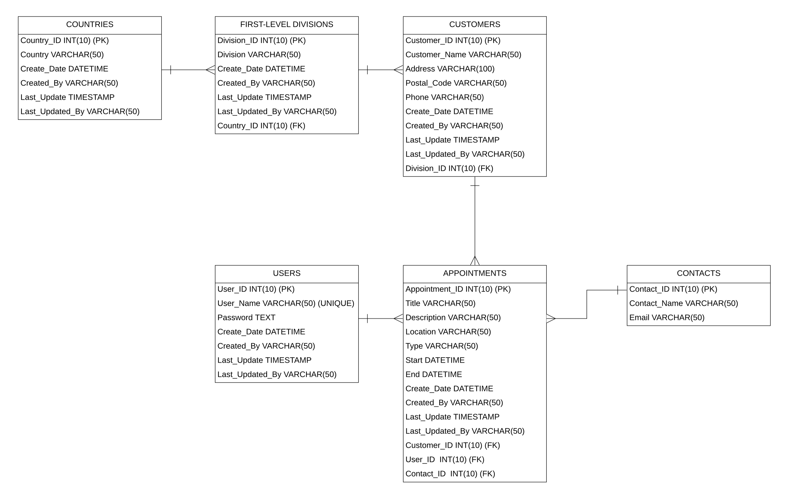

## GVS (Global Virtual Scheduler)
### A Desktop Scheduling Application made with a JavaFX GUI and mySQL database integration

Program depends on MySQL database to store data for retrieval, insertion, and deletion. Designed using the MVC and DAO design patterns. Entity Relationship Diagram (ERD) shown below.

Suggestions for improvements and further modifications are welcome; feel free to leave a PR for review or connect with me on LinkedIn.

 
Features:

- Log-in form with the following capabilities:
  - Accept username, password, and verify with database
  - Record all login attempts, failed and successful, in login_activity.txt (root directory)
  - Display all text, including error messages, in system language
  - Display user time zone
- Employee dashboard for user to navigate to various pages
  - On log-in, an alert is displayed showing whether there is appointment scheduled to start in the next 15 minutes
- User can add, update, and delete customer records
  - If a customer has an existing appointment, prevents deletion to ensure data integrity
  - Ensure that customers cannot have overlapping appointments
- Users can add, update, and delete customer appointments
- Generate three different types of data reports
- All times are displayed in local time zone, but stored in UTC
- Exception handling and error control

Technical Specifications:

- IDE: IntelliJ IDEA 2022.3.1 (Community)
- JDK: 1.8 Oracle OpenJDKv17.0.5
- SQL Connector Driver: mysql-connector-java-8.0.33
- MySQL Workbench v8.0.33
  

### ERD Diagram

